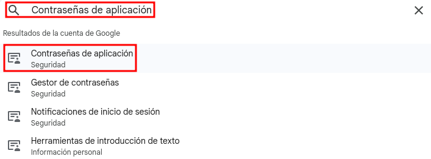
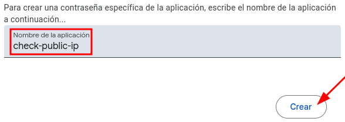

# check-public-ip

Este es un servicio para verificar la IP pública y enviarla por correo si cambia.

## Configuración Servidor de Correo

```bash
sudo apt install postfix mailutils -y
```






Cuando se crea se mostrará una ventana con la contraseña de aplicación, será necesaria copiarla para usarla posteriormente.

```bash
sudo nano /etc/postfix/sasl_passwd
```

Añadimos la siguiente línea:

```bash
[smtp.gmail.com]:587 correo@gmail.com:contraseña_de_aplicación_sin_espacios
```

```bash
sudo nano /etc/postfix/main.cf
```

Comentamos las siguientes líneas:

```bash
relayhost =
smtp_tls_security_level = may
```

Añadimos las siguientes líneas al final del fichero:

```bash
relayhost = [smtp.gmail.com]:587

smtp_use_tls = yes
smtp_tls_security_level = encrypt
smtp_tls_note_starttls_offer = yes

smtp_sasl_auth_enable = yes
smtp_sasl_password_maps = hash:/etc/postfix/sasl_passwd
smtp_sasl_security_options = noanonymous
smtp_sasl_mechanism_filter = plain, login
```

```bash
sudo postmap /etc/postfix/sasl_passwd
sudo chmod 600 /etc/postfix/sasl_passwd /etc/postfix/sasl_passwd.db
sudo systemctl restart postfix
```

## Instalación del Servicio

```bash
git clone https://github.com/f1rul4yx/check-public-ip.git
cd check-public-ip
sudo ./install.sh
```
